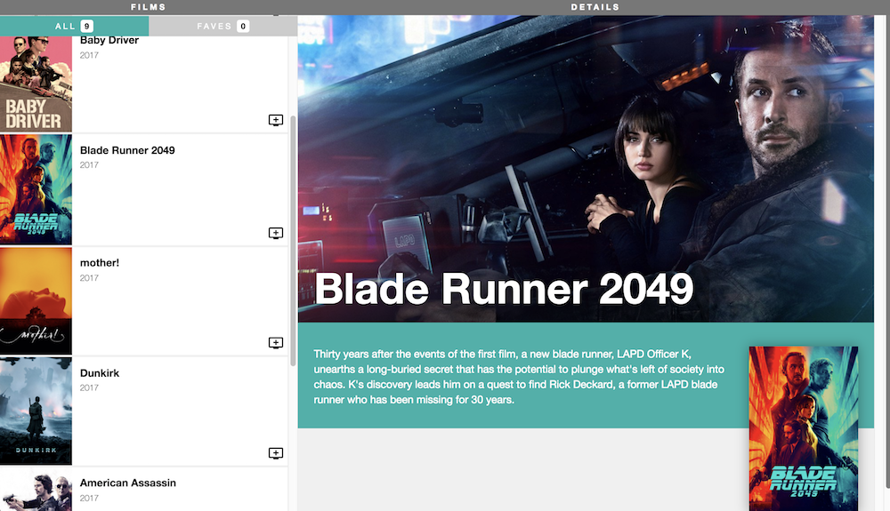

# The Film Project Lab

## Overview

This is a multi-part exercise to learn React.
At the end of all four parts of this exercise, you'll have this app:

**Important**: After each step, check your application to see how it looks before moving on. It's good practice to make sure your app is working correctly before adding new functionality.

### Part 1

[Go to the Part 1 instructions](Part_1.md)

### Part 2

[Go to the Part 2 instructions](Part_2.md)

### Part 3

[Go to the Part 3 instructions](Part_3.md)

#### Part 4

[Go to the Part 4 instructions](Part_4.md)
